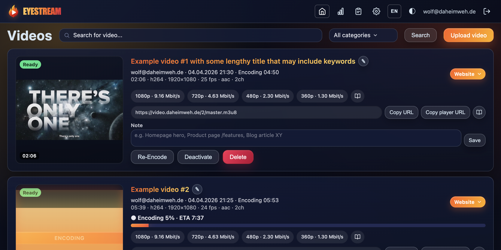

# Eyestream

[](LICENSE)
[](https://github.com/wvogel/eyestream/actions/workflows/test.yml)
[](https://www.python.org/downloads/)
[](https://docs.docker.com/compose/)

Self-hosted video platform with HLS adaptive streaming, admin UI, and embed player. Upload videos, encode them automatically into multiple quality levels, and deliver them via static Nginx — no app server in the streaming path.



## Architecture


## Requirements

- Docker and Docker Compose (v2+)
- A reverse proxy with HTTPS (see below)
- An OIDC provider for authentication (Entra ID, Authentik, Keycloak, Google, etc.)

## Quick Start

```bash
cp .env.example .env                   # Edit with your settings
cp oauth2-proxy.env.example oauth2-proxy.env  # Edit with your OIDC provider
docker network create shared-npm 2>/dev/null || true
docker compose up -d --build
```

Open `https://your-admin-domain/` to access the admin UI.

## Reverse Proxy

Eyestream requires a reverse proxy that terminates HTTPS and forwards traffic to the containers. Two services need to be reachable from the proxy:

- **Public Nginx** (container `eyestream-public`) — serves HLS streams, embed player, posters
- **OAuth2-Proxy** (container `eyestream-oauth2-proxy`) — serves the admin UI behind authentication

The stack joins an external Docker network (`shared-npm` by default) where your reverse proxy runs. Any reverse proxy works:

| Proxy | Log-based referer analysis |
|-------|---------------------------|
| [**Nginx Proxy Manager**](https://github.com/NginxProxyManager/nginx-proxy-manager) | Yes — mount NPM's log directory and set `NPM_SITE_ID` |
| **Traefik**, **Caddy**, **nginx**, etc. | Proxy works, but view counts and referer tracking on the stats page will not be available (these rely on NPM's access log format) |

```bash
# Create the shared network if it doesn't exist
docker network create shared-npm
```

Adjust the network name in `docker-compose.yml` if you use a different one.

## Features

### Video Management
- Upload with category assignment and notes
- Inline editing (title: double-click or pencil, notes: contenteditable with search highlighting)
- Categories for organization with filter dropdown
- Autocomplete search across titles, notes, and category names
- Disable/enable videos (public URLs return 404, admin retains full access)
- Custom poster from any video frame (ffmpeg extraction from original, not canvas capture)
- Hover preview (6 rotating thumbnails, 320px admin + 960px embed)
- Duration badge, view count badge, referer site badges on poster
- Configurable items per page (10/20/50/100/All, persistent)

### Streaming & Embedding
- HLS Adaptive Bitrate (1080p, 720p, 480p, 360p via CMAF/fMP4)
- Public embed player (`/embed/{id}`) with poster, hover thumbnails, click-to-play
- oEmbed endpoint for automatic rich embeds (Outline Wiki, etc.)
- Raw `.m3u8` URL for custom player integration

### Statistics (`/stats`)
- Video counts with status breakdown
- Total duration, average encoding factor
- Disk usage pie chart (uploads, HLS, system, free)
- Category breakdown (interactive sorting, persistent)
- Trend graph: playlist requests over last 4 days (requires Nginx Proxy Manager logs)
- Top referer sites with hit counts (requires Nginx Proxy Manager logs)
- Worker status with live CPU% (5s polling)
- Disk space warning (>90%), orphaned upload detection

### Activity Log (`/activity`)
- Tracks: upload, delete, rename, note, category, poster, re-encode, disable/enable
- Color-coded action badges, paginated, auto-cleanup after 90 days

### Monitoring
- `GET /health` — simple health check
- `GET /health/detailed` — checks database, disk, worker heartbeat, ffmpeg, video counts

### UI/UX
- Dark/Light/Auto theme toggle
- German + English (switchable in header)
- Fire-themed design with flame gradient headings and animated overlays
- CPU flame overlay during encoding
- Responsive layout, sticky header
- Custom HTML dropdowns (no native select elements)
- SSE (Server-Sent Events) for real-time encoding progress

## Configuration

All branding and settings are configurable via environment variables. Copy `.env.example` to `.env`:

### Branding

| Variable | Default | Description |
|----------|---------|-------------|
| `BRAND_NAME` | `Eyestream` | Brand name (logo alt text) |
| `PRODUCT_NAME` | `Eyestream` | Product name (header, title, splash) |
| `LOGO_URL` | *(empty)* | Logo URL (header, splash screen) |
| `PUBLIC_BASE` | `https://localhost` | Public CDN URL |
| `FOOTER_LINKS` | *(empty)* | Footer links, format: `Label1\|URL1,Label2\|URL2` |
| `COPYRIGHT_TEXT` | *(empty)* | Copyright text in footer |
| `EXAMPLE_PAGE_URL` | *(empty)* | Example page URL (header link, empty = hidden) |

### Database

| Variable | Default | Description |
|----------|---------|-------------|
| `DB_NAME` | `eyestream` | Database name |
| `DB_USER` | `eyestream` | Database user |
| `DB_PASSWORD` | `eyestream` | Database password |

### Optional: Reverse Proxy Log Analysis

View counts and referer tracking require Nginx Proxy Manager access logs. Without these, the stats page works but skips the trend graph and referer sections.

| Variable | Default | Description |
|----------|---------|-------------|
| `NPM_SITE_ID` | *(empty)* | NPM proxy host ID (empty = disabled) |
| `NPM_LOG_HOST_PATH` | `../npm/data/logs` | Host path to NPM log directory |
| `REFERER_IGNORE_SEEDS` | `localhost` | Comma-separated domains to ignore in referer analysis |

### Authentication

Authentication is handled by [OAuth2-Proxy](https://github.com/oauth2-proxy/oauth2-proxy). Copy `oauth2-proxy.env.example` to `oauth2-proxy.env` and configure your OIDC provider (Entra ID, Authentik, Keycloak, Google, etc.).

## File Structure

```
app/
  main.py              # Entrypoint, lifespan, middleware
  db.py                # Schema, connection pool
  helpers.py           # Helper functions, constants
  routes/
    videos.py          # Video CRUD, SSE, poster, player proxy
    settings.py        # Settings, stats, categories
    misc.py            # Health, monitoring, activity, search, referers
  templates/           # Jinja2 templates
  static/
    base.css           # Variables, header, footer, buttons, pagination
    components.css     # Video cards, player, overlays, modals
    pages.css          # Upload, settings, stats pages
    app.js             # Client-side JavaScript

worker/
  worker.py            # Encoding pipeline, preview thumbnails, heartbeat

nginx-public/
  default.conf         # Nginx config with oEmbed endpoint
  embed.html           # Public embed player with hover previews

config/
  ladder.yml           # Encoding profiles (renditions, bitrates)

tests/                 # Unit + integration tests (55+)
docs/                  # Documentation + architecture diagram
```

## Tests

```bash
pip install -r tests/requirements-test.txt
pytest tests/ -v
```

## Deployment

For updates, prefer selective rebuilds over full `docker compose down`:

```bash
docker compose up -d --build app worker
```

This keeps the public Nginx running — no streaming interruption.

## License

[MIT](LICENSE)
