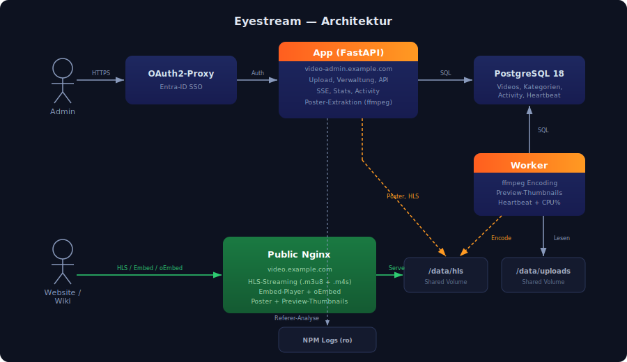

# Eyestream — IT-Dokumentation (v4.0)

## Repository

- GitLab: [gitlab.example.com/it/eyestream](https://gitlab.example.com/it/eyestream)
- SSH: `ssh://git@gitlab.example.com:2222/it/eyestream.git`

## Architektur

Videos werden über **video-admin.example.com** hochgeladen, in einem zentralen Storage abgelegt und zum Encoding gequeued. Ein separater Worker encodiert asynchron in mehrere HLS-Qualitätsstufen. Die Auslieferung erfolgt statisch über **video.example.com**.

Status, Metadaten und Konfiguration liegen in PostgreSQL. Die Admin-Oberfläche ist per Entra-ID SSO abgesichert. Encoding und Web-UI sind entkoppelt.



## Services

| Service | Container | Funktion |
|---------|-----------|----------|
| `app` | FastAPI | Admin-UI, API, SSE-Fortschritt |
| `worker` | ffmpeg/ffprobe | Encoding-Pipeline, Preview-Thumbnails, Heartbeat |
| `public` | Nginx | HLS-Auslieferung, Embed-Player, oEmbed |
| `postgres` | PostgreSQL 18 | Datenbank |
| `oauth2-eyestream` | OAuth2-Proxy | Entra-ID SSO |

## Zugriffe

### video.example.com (Public)

Ohne Auth. Liefert HLS-Streams, Poster, Preview-Thumbnails, Embed-Player und oEmbed-Endpoint.

- Streaming: `https://video.example.com/{id}/master.m3u8`
- Poster: `https://video.example.com/{id}/poster.jpg`
- Embed: `https://video.example.com/embed/{id}`
- oEmbed: `https://video.example.com/oembed?url=...`

### video-admin.example.com (Auth)

Entra-ID SSO. Freigegebene Gruppen:

| ID | Gruppe |
|----|--------|
Konfigurierbar via `OAUTH2_PROXY_ALLOWED_GROUPS` in `oauth2-proxy.env`.

## Modulstruktur

```
app/
  main.py              Entrypoint, Lifespan, Middleware
  db.py                Schema, Migrationen, Connection Pool
  helpers.py           Hilfsfunktionen, Konstanten
  routes/
    videos.py          Video-CRUD, SSE, Poster, Player-Proxy
    settings.py        Einstellungen, Stats, Bereiche
    misc.py            Health, Activity, Suche, Referer
  templates/           Jinja2-Templates
  static/
    base.css           Variablen, Header, Footer, Buttons, Pagination
    components.css     Video-Cards, Player, Overlays, Modals
    pages.css          Upload, Settings, Stats
    app.js             Client-JS

worker/
  worker.py            Encoding, Previews (320px + 960px), Heartbeat

nginx-public/
  default.conf         Nginx-Config mit oEmbed
  embed.html           Embed-Player mit Hover-Previews
```

## Admin-Oberfläche

### Video-Übersicht (`/`)

> **Screenshot-Vorschlag:** Video-Übersicht im Dark Mode mit mehreren Video-Cards, Pagination und Suchleiste.

- Suche über Titel, Notizen und Bereichsnamen (Autocomplete)
- Filter nach Bereich (Custom-Dropdown)
- Konfigurierbare Einträge pro Seite (10/20/50/100/Alle, persistent)
- Poster mit Badges: Ready, Dauer, Aufrufe (4 Tage), Referer-Sites
- Hover-Preview: 6 Thumbnails rotieren (320px)
- Inline-Editing: Titel (Doppelklick oder Stift), Notiz (contenteditable mit Suchtreffer-Highlighting)
- Bereichszuweisung per Custom-Dropdown (Feuer-Optik)
- Aktionen: Re-Encode, Deaktivieren/Aktivieren (Doppelbestätigung), Löschen (mit Titel-Anzeige)
- Encoding-Fortschritt: SSE statt Polling, CPU-Flammen-Overlay auf dem Poster

### Video-Player

> **Screenshot-Vorschlag:** Inline-Player mit "Vorschaubild setzen"-Button oben.

- HLS.js Adaptive Bitrate (1080p/720p/480p/360p)
- Poster setzen: Video pausieren, Button klickt, ffmpeg extrahiert Frame aus Original (kein Canvas-Capture)

### Upload (`/upload`)

> **Screenshot-Vorschlag:** Upload-Seite mit Drag & Drop Zone und Bereichsauswahl.

- Drag & Drop oder Datei-Auswahl
- Bereich-Pflichtfeld (letzter Bereich wird gemerkt)
- Video-Dauer wird vor Upload angezeigt
- Upload-Fortschritt mit Flammen-Animation
- Navigation-Warnung bei laufendem Upload

### Statistiken (`/stats`)

> **Screenshot-Vorschlag:** Stats-Seite mit 4 Kacheln, Kuchendiagramm und Trend-Graph.

4-Spalten-Grid:
1. Videos (Anzahl + Status-Aufschlüsselung)
2. Gesamtdauer
3. Encoding-Faktor
4. Worker-Status (CPU%, Live-Update alle 5s)

Kuchendiagramm: Uploads/HLS/System/Frei
Bereiche: Interaktiv sortierbar (Klick auf Namen = alphabetisch, Klick auf Bars = nach Anzahl/Skalierung), persistent in localStorage

Trend-Graph: Playlist-Aufrufe der letzten 4 Tage (SVG-Liniendiagramm)
Top-Referer: Domains mit Hit-Counts
Warnungen: Disk >90%, verwaiste Upload-Dateien (aufklappbar)

### Einstellungen (`/settings`)

> **Screenshot-Vorschlag:** Settings-Seite mit Bereichen und Referer-Ausschlüssen.

- Bereiche: CRUD, klickbar zur gefilterten Übersicht
- Referer-Ausschlüsse: Domain-Patterns (Teilübereinstimmung), Seeds konfigurierbar via `REFERER_IGNORE_SEEDS`

### Aktivitätslog (`/activity`)

> **Screenshot-Vorschlag:** Aktivitätslog mit farbigen Action-Badges.

Protokolliert: Upload, Delete, Rename, Notiz, Bereich, Poster, Re-Encode, Deaktivieren/Aktivieren. Farbige Badges, paginiert, Auto-Cleanup nach 90 Tagen.

## Embed-Player

```
https://video.example.com/embed/{id}
```

- Poster mit Hover-Previews (960px, 6 Thumbnails)
- Click-to-Play HLS-Streaming
- oEmbed-Discovery für Outline Wiki (automatisches Rich-Embed)
- Deaktivierte Videos: "Dieses Video ist nicht verfügbar."

## Deaktivierung

Deaktivierte Videos:
- HLS-Verzeichnis wird zu `.disabled_{id}` umbenannt
- Public Nginx: 404 (Streaming, Embed, Poster)
- Admin: Vollzugriff (Player, Poster setzen, Re-Encode) über App-Proxy `/video/{id}/file/...`
- Schraffierter Hintergrund + "DEAKTIVIERT"-Overlay in der Übersicht

## Encoding

CMAF/fMP4 HLS mit 4 Renditions (1080p/720p/480p/360p). Konfiguration in `config/ladder.yml`.

Ablauf:
1. Upload → `status='queued'`
2. Worker pickt Job → Early-Poster in `final_dir`
3. Encoding pro Rendition in `tmp_dir`, Fortschritt via DB → SSE
4. Preview-Thumbnails (6x 320px + 6x 960px)
5. Atomarer Directory-Swap (rename, kein Downtime-Fenster)
6. `status='ready'`

Worker-Heartbeat: Schreibt alle 5s Status + CPU% in `worker_heartbeat`-Tabelle.

## Performance & Caching

| Ressource | Cache/Intervall |
|-----------|----------------|
| Referer-Analyse (zgrep) | 10 min |
| Disk-Stats (du -sb) | 10 min |
| Worker-Status Poll | 5s |
| SSE Encoding-Updates | 3s |
| Worker Progress-Write | 2s |
| Worker Idle-Loop | 5s |
| Poster-Extraktion | 5s Cooldown/Video |

## Deployment

GitLab CI/CD auf `deploy.example.com`. Pipeline: `git pull → docker compose up -d --build`.

Versionierung: `Version 3.0.{git-short-hash}`

Selektive Updates bevorzugen (`docker compose up -d --build app worker`) statt komplettes `down` — public Nginx soll durchlaufen.

## Umgebungsvariablen

| Variable | Default | Beschreibung |
|----------|---------|-------------|
| `DB_HOST` | `postgres` | PostgreSQL Host |
| `UPLOAD_DIR` | `/data/uploads` | Upload-Verzeichnis |
| `HLS_DIR` | `/data/hls` | HLS-Ausgabe |
| `NPM_LOG_DIR` | `/data/npm-logs` | NPM-Logs (readonly) |
| `NPM_SITE_ID` | `42` | NPM Proxy-Host-ID |
| `MAX_UPLOAD_BYTES` | `10737418240` | Max. Upload (10 GB) |

## Website-Integration

### Standard-Player (Video.js)

```html
<link href="https://vjs.zencdn.net/8.10.0/video-js.css" rel="stylesheet" />
<video
  class="video-js vjs-default-skin"
  controls
  preload="metadata"
  poster="https://video.example.com/{id}/poster.jpg"
  data-setup='{"fluid": true}'>
  <source src="https://video.example.com/{id}/master.m3u8"
          type="application/x-mpegURL">
</video>
<script src="https://vjs.zencdn.net/8.10.0/video.min.js"></script>
```

### Hero-Player (Autoplay, stummgeschaltet)

```html
<video
  class="video-js vjs-default-skin"
  autoplay muted loop playsinline
  preload="auto"
  poster="https://video.example.com/{id}/poster.jpg"
  data-setup='{"fluid": true, "controls": false}'>
  <source src="https://video.example.com/{id}/master.m3u8"
          type="application/x-mpegURL">
</video>
```

### Poster-URL ableiten

`master.m3u8` durch `poster.jpg` ersetzen:
`https://video.example.com/40/master.m3u8` → `https://video.example.com/40/poster.jpg`

## Monitoring

### Health-Check

`GET /health` — Einfacher Check, gibt `{"status": "ok"}` zurück.

### Detaillierter Health-Check

`GET /health/detailed` — Prüft alle Subsysteme:

| Check | Prüft |
|-------|-------|
| `database` | SQL-Verbindung |
| `upload_dir` | Existenz + Schreibrechte |
| `hls_dir` | Existenz + Schreibrechte |
| `worker` | Heartbeat-Alter, Status, CPU% |
| `ffmpeg` | Verfügbarkeit |
| `disk` | Belegung, Warnung bei >90% |
| `videos` | Counts (total, ready, encoding, queued, disabled) |
| `npm_logs` | Log-Verzeichnis verfügbar |

Antwort:
```json
{
  "status": "ok",
  "version": "Version 3.1.abc1234",
  "checks": {
    "database": {"status": "ok"},
    "worker": {"status": "ok", "worker_status": "idle", "last_seen_seconds_ago": 3, "cpu_percent": 12},
    "disk": {"status": "ok", "used_percent": 42.3, "free_gb": 873.7},
    "videos": {"total": 95, "ready": 92, "encoding": 0, "queued": 0, "disabled": 3},
    ...
  }
}
```

`status` ist `"ok"` oder `"degraded"` (wenn ein Check fehlschlägt).

### Worker-Status

`GET /worker/status` — Live-Status des Workers (CPU%, Heartbeat-Alter). Wird auf der Stats-Seite alle 5s gepollt.

## Tests

```bash
pip install -r tests/requirements-test.txt
pytest tests/ -v
```

55+ Tests:
- **Helper-Unit-Tests** (`test_main_helpers.py`): format_duration, parse_streams, highlight, validate_upload, copy_with_size_limit
- **Worker-Unit-Tests** (`test_worker_helpers.py`): codecs_for_profile, width_from_height, count_segments
- **API-Integration-Tests** (`test_api.py`): Smoke-Tests für alle Seiten und Endpoints, Validierung, Security (Path Traversal, große IDs), Pagination, Monitoring

## Changelog

### v4.2 (April 2026)
- Security: HTTP-Header (X-Frame-Options, X-Content-Type-Options, Referrer-Policy, Permissions-Policy)
- Security: CSRF-Schutz per Origin/Referer-Validierung
- Security: Health-Endpoint gibt keine internen Pfade mehr preis
- Security: SRI-Hashes auf CDN-Scripts (HLS.js)
- Google Fonts entfernt — nur noch System-Fonts (DSGVO-konform)
- Encoding-Fortschritt gewichtet nach Rendition-Auflösung (realistischere ETA)
- Worker-Heartbeat und CPU-Anzeige auch während des Encodings
- Custom Poster bleibt bei Re-Encode erhalten
- Kein Seiten-Reload mehr bei Aktionen (Re-Encode, Delete, Deaktivieren, Titel-Edit)
- Re-Encode-Doppelklick-Schutz, Cancel-Button erscheint sofort
- Logo-Schriftzug mit Feuer-Gradient-Animation (60s, uhrzeit-synchron)
- Icon-Font entfernt (Copyright-Risiko) — alle Icons als inline SVGs
- Header: Home-Icon immer sichtbar, aktive Seite mit Rahmen
- Pagination: zentrierte Info, Pagesize-Dropdown oben ↓, unten ↑

### v4.0 (April 2026)
- Open-Source-Release: Alles Branding über Umgebungsvariablen konfigurierbar
- Keine hardcoded Domains, Logos, Firmennamen oder Credentials im Code
- `.env.example` und `oauth2-proxy.env.example` als Konfigurationsvorlagen
- CSS-Variable `--se-blue` umbenannt zu `--primary`
- Monitoring-Endpoint `/health/detailed` mit umfassendem Subsystem-Check
- 55+ automatisierte Tests (Unit + API + Security)
- Embed-Player: Favicon, dynamischer Tab-Titel, Hover-Previews (960px)
- Dokumentation: IT-Handbuch, Benutzerhandbuch, Architektur-SVG
- i18n: Deutsch + Englisch (DE/EN-Umschalter im Header)
- Komplettes Rename: Departments → Categories (DB, API, CSS, JS, Templates, Tests)
- DB-Credentials aus docker-compose.yml in .env ausgelagert

### v3.1 (April 2026)
- Detaillierter Monitoring-Endpoint (`/health/detailed`)
- 55+ automatisierte Tests (Unit + API + Security)
- Embed-Player: Favicon, Tab-Titel mit Video-ID, Hover-Previews (960px)
- 4-Spalten Stats-Layout mit Worker-CPU-Live-Anzeige
- Interaktiv sortierbare Bereiche-Balken (persistent)
- Verwaiste Upload-Dateien: aufklappbare Dateiliste
- Performance: Disk-Stats Cache (10 min), Referer-Cache (10 min), Worker-Poll (5s)
- IT-Dokumentation + Benutzerhandbuch + Architektur-Diagramm (SVG)

### v3.0 (April 2026)
- Bereiche mit Filterfunktion
- Custom HTML-Dropdowns (Feuer-Optik)
- Statistiken-Seite mit Kuchendiagramm, Trend-Graph, Worker-Status
- Referer-Analyse aus NPM-Logs
- Aktivitätslog
- Embed-Player mit oEmbed und Hover-Previews
- SSE statt Polling
- Dark/Light/Auto Theme-Toggle
- Video deaktivieren/aktivieren
- Custom Poster setzen (ffmpeg aus Original)
- Suchvorschläge (Autocomplete)
- Modularer Code (main.py aufgeteilt in db/helpers/routes)
- CSS aufgeteilt (base/components/pages)
- JS extrahiert (app.js)
- Security-Audit und Fixes (XSS, Path Traversal, Rate Limiting)

### v2.0 (Februar 2026)
- CMAF/fMP4 HLS
- Atomarer Re-Encode
- FIFO-Queue
- Admin-UI mit Dark Mode
