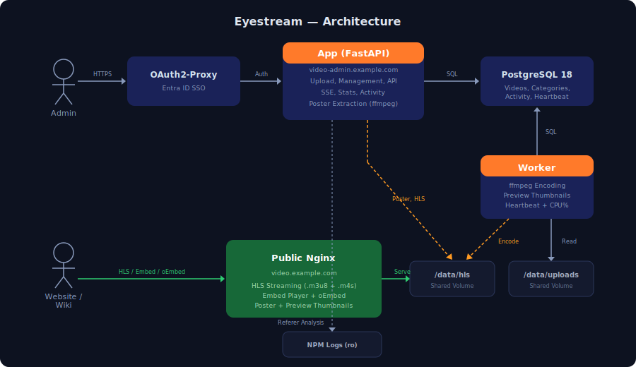

# Eyestream — IT Documentation (v4.0)

## Repository

- GitLab: [gitlab.example.com/it/eyestream](https://gitlab.example.com/it/eyestream)
- SSH: `ssh://git@gitlab.example.com:2222/it/eyestream.git`

## Architecture

Videos are uploaded via **video-admin.example.com**, stored in a central storage location, and queued for encoding. A separate worker encodes them asynchronously into multiple HLS quality levels. Delivery is handled statically via **video.example.com**.

Status, metadata, and configuration are stored in PostgreSQL. The admin interface is secured via Entra ID SSO. Encoding and web UI are decoupled.



## Services

| Service | Container | Function |
|---------|-----------|----------|
| `app` | FastAPI | Admin UI, API, SSE progress |
| `worker` | ffmpeg/ffprobe | Encoding pipeline, preview thumbnails, heartbeat |
| `public` | Nginx | HLS delivery, embed player, oEmbed |
| `postgres` | PostgreSQL 18 | Database |
| `oauth2-eyestream` | OAuth2-Proxy | Entra ID SSO |

## Access

### video.example.com (Public)

No authentication. Serves HLS streams, posters, preview thumbnails, embed player, and oEmbed endpoint.

- Streaming: `https://video.example.com/{id}/master.m3u8`
- Poster: `https://video.example.com/{id}/poster.jpg`
- Embed: `https://video.example.com/embed/{id}`
- oEmbed: `https://video.example.com/oembed?url=...`

### video-admin.example.com (Auth)

Entra ID SSO. Authorized groups:

| ID | Group |
|----|-------|
Configurable via `OAUTH2_PROXY_ALLOWED_GROUPS` in `oauth2-proxy.env`.

## Module Structure

```
app/
  main.py              Entrypoint, lifespan, middleware
  db.py                Schema, migrations, connection pool
  helpers.py           Utility functions, constants
  routes/
    videos.py          Video CRUD, SSE, poster, player proxy
    settings.py        Settings, stats, categories
    misc.py            Health, activity, search, referer
  templates/           Jinja2 templates
  static/
    base.css           Variables, header, footer, buttons, pagination
    components.css     Video cards, player, overlays, modals
    pages.css          Upload, settings, stats
    app.js             Client JS

worker/
  worker.py            Encoding, previews (320px + 960px), heartbeat

nginx-public/
  default.conf         Nginx config with oEmbed
  embed.html           Embed player with hover previews
```

## Admin Interface

### Video Overview (`/`)

> **Screenshot suggestion:** Video overview in dark mode with multiple video cards, pagination, and search bar.

- Search by title, notes, and category names (autocomplete)
- Filter by category (custom dropdown)
- Configurable items per page (10/20/50/100/All, persistent)
- Poster with badges: Ready, duration, loads (4 days), referer sites
- Hover preview: 6 thumbnails rotate (320px)
- Inline editing: title (double-click or pencil icon), notes (contenteditable with search highlight)
- Category assignment via custom dropdown (flame style)
- Actions: Re-encode, Disable/Enable (double confirmation), Delete (shows title)
- Encoding progress: SSE instead of polling, CPU flame overlay on poster

### Video Player

> **Screenshot suggestion:** Inline player with "Set poster" button at the top.

- HLS.js adaptive bitrate (1080p/720p/480p/360p)
- Set poster: pause the video, click button, ffmpeg extracts frame from original (no canvas capture)

### Upload (`/upload`)

> **Screenshot suggestion:** Upload page with drag & drop zone and category selection.

- Drag & drop or file selection
- Category is required (last category is remembered)
- Video duration is shown before upload
- Upload progress with flame animation
- Navigation warning during active upload

### Statistics (`/stats`)

> **Screenshot suggestion:** Stats page with 4 tiles, pie chart, and trend graph.

4-column grid:
1. Videos (count + status breakdown)
2. Total duration
3. Encoding factor
4. Worker status (CPU%, live update every 5s)

Pie chart: Uploads/HLS/System/Free
Categorys: Interactively sortable (click name = alphabetical, click bars = by count/scale), persistent in localStorage

Trend graph: Playlist loads over the last 4 days (SVG line chart)
Top referers: Domains with hit counts
Warnings: Disk >90%, orphaned upload files (expandable)

### Settings (`/settings`)

> **Screenshot suggestion:** Settings page with categories and referer exclusions.

- Categorys: CRUD, clickable to filtered overview
- Referer exclusions: Domain patterns (partial match), seeds configurable via `REFERER_IGNORE_SEEDS`

### Activity Log (`/activity`)

> **Screenshot suggestion:** Activity log with colored action badges.

Logs: Upload, Delete, Rename, Note, Category, Poster, Re-Encode, Disable/Enable. Colored badges, paginated, auto-cleanup after 90 days.

## Embed Player

```
https://video.example.com/embed/{id}
```

- Poster with hover previews (960px, 6 thumbnails)
- Click-to-play HLS streaming
- oEmbed discovery for Outline Wiki (automatic rich embed)
- Disabled videos: "This video is not available."

## Deactivation

Disabled videos:
- HLS directory is renamed to `.disabled_{id}`
- Public Nginx: 404 (streaming, embed, poster)
- Admin: Full access (player, set poster, re-encode) via app proxy `/video/{id}/file/...`
- Hatched background + "DISABLED" overlay in the overview

## Encoding

CMAF/fMP4 HLS with 4 renditions (1080p/720p/480p/360p). Configuration in `config/ladder.yml`.

Process:
1. Upload → `status='queued'`
2. Worker picks job → early poster in `final_dir`
3. Encoding per rendition in `tmp_dir`, progress via DB → SSE
4. Preview thumbnails (6x 320px + 6x 960px)
5. Atomic directory swap (rename, no downtime window)
6. `status='ready'`

Worker heartbeat: Writes status + CPU% to `worker_heartbeat` table every 5s.

## Performance & Caching

| Resource | Cache/Interval |
|----------|---------------|
| Referer analysis (zgrep) | 10 min |
| Disk stats (du -sb) | 10 min |
| Worker status poll | 5s |
| SSE encoding updates | 3s |
| Worker progress write | 2s |
| Worker idle loop | 5s |
| Poster extraction | 5s cooldown/video |

## Deployment

GitLab CI/CD on `deploy.example.com`. Pipeline: `git pull → docker compose up -d --build`.

Versioning: `Version 3.0.{git-short-hash}`

Prefer selective updates (`docker compose up -d --build app worker`) over full `down` — public Nginx should keep running.

## Environment Variables

| Variable | Default | Description |
|----------|---------|------------|
| `DB_HOST` | `postgres` | PostgreSQL host |
| `UPLOAD_DIR` | `/data/uploads` | Upload directory |
| `HLS_DIR` | `/data/hls` | HLS output |
| `NPM_LOG_DIR` | `/data/npm-logs` | NPM logs (readonly) |
| `NPM_SITE_ID` | `42` | NPM proxy host ID |
| `MAX_UPLOAD_BYTES` | `10737418240` | Max upload (10 GB) |

## Website Integration

### Standard Player (Video.js)

```html
<link href="https://vjs.zencdn.net/8.10.0/video-js.css" rel="stylesheet" />
<video
  class="video-js vjs-default-skin"
  controls
  preload="metadata"
  poster="https://video.example.com/{id}/poster.jpg"
  data-setup='{"fluid": true}'>
  <source src="https://video.example.com/{id}/master.m3u8"
          type="application/x-mpegURL">
</video>
<script src="https://vjs.zencdn.net/8.10.0/video.min.js"></script>
```

### Hero Player (Autoplay, muted)

```html
<video
  class="video-js vjs-default-skin"
  autoplay muted loop playsinline
  preload="auto"
  poster="https://video.example.com/{id}/poster.jpg"
  data-setup='{"fluid": true, "controls": false}'>
  <source src="https://video.example.com/{id}/master.m3u8"
          type="application/x-mpegURL">
</video>
```

### Deriving the Poster URL

Replace `master.m3u8` with `poster.jpg`:
`https://video.example.com/40/master.m3u8` → `https://video.example.com/40/poster.jpg`

## Monitoring

### Health Check

`GET /health` — Simple check, returns `{"status": "ok"}`.

### Detailed Health Check

`GET /health/detailed` — Checks all subsystems:

| Check | Verifies |
|-------|----------|
| `database` | SQL connection |
| `upload_dir` | Existence + write permissions |
| `hls_dir` | Existence + write permissions |
| `worker` | Heartbeat age, status, CPU% |
| `ffmpeg` | Availability |
| `disk` | Usage, warning at >90% |
| `videos` | Counts (total, ready, encoding, queued, disabled) |
| `npm_logs` | Log directory available |

Response:
```json
{
  "status": "ok",
  "version": "Version 3.1.abc1234",
  "checks": {
    "database": {"status": "ok"},
    "worker": {"status": "ok", "worker_status": "idle", "last_seen_seconds_ago": 3, "cpu_percent": 12},
    "disk": {"status": "ok", "used_percent": 42.3, "free_gb": 873.7},
    "videos": {"total": 95, "ready": 92, "encoding": 0, "queued": 0, "disabled": 3},
    ...
  }
}
```

`status` is `"ok"` or `"degraded"` (if a check fails).

### Worker Status

`GET /worker/status` — Live worker status (CPU%, heartbeat age). Polled every 5s on the stats page.

## Tests

```bash
pip install -r tests/requirements-test.txt
pytest tests/ -v
```

55+ tests:
- **Helper unit tests** (`test_main_helpers.py`): format_duration, parse_streams, highlight, validate_upload, copy_with_size_limit
- **Worker unit tests** (`test_worker_helpers.py`): codecs_for_profile, width_from_height, count_segments
- **API integration tests** (`test_api.py`): Smoke tests for all pages and endpoints, validation, security (path traversal, large IDs), pagination, monitoring

## Changelog

### v4.2 (April 2026)
- Security: HTTP headers (X-Frame-Options, X-Content-Type-Options, Referrer-Policy, Permissions-Policy)
- Security: CSRF protection via Origin/Referer validation
- Security: Health endpoint no longer exposes internal paths
- Security: SRI integrity hashes on CDN scripts (HLS.js)
- Removed Google Fonts — system fonts only (GDPR compliant)
- Encoding progress weighted by rendition resolution (more accurate ETA)
- Worker heartbeat and CPU display during encoding
- Custom poster preserved on re-encode
- No page reload on actions (re-encode, delete, deactivate, title edit)
- Re-encode double-click protection, cancel button appears immediately
- Brand logo with fire gradient animation (60s, clock-synced)
- Icon font removed (copyright risk) — all icons as inline SVGs
- Header: home icon always visible, active page highlighted with border
- Pagination: centered info, pagesize dropdown opens up at bottom

### v4.0 (April 2026)
- Open source release: All branding configurable via environment variables
- No hardcoded domains, logos, company names, or credentials in code
- `.env.example` and `oauth2-proxy.env.example` as configuration templates
- CSS variable `--se-blue` renamed to `--primary`
- Monitoring endpoint `/health/detailed` with comprehensive subsystem checks
- 55+ automated tests (unit + API + security)
- Embed player: Favicon, dynamic tab title, hover previews (960px)
- Documentation: IT handbook, user guide, architecture SVG
- i18n: German + English (DE/EN toggle in header)
- Full rename: Departments → Categories (DB, API, CSS, JS, templates, tests)
- DB credentials moved from docker-compose.yml to .env

### v3.1 (April 2026)
- Detailed monitoring endpoint (`/health/detailed`)
- 55+ automated tests (unit + API + security)
- Embed player: Favicon, tab title with video ID, hover previews (960px)
- 4-column stats layout with worker CPU live display
- Interactively sortable category bars (persistent)
- Orphaned upload files: expandable file list
- Performance: Disk stats cache (10 min), referer cache (10 min), worker poll (5s)
- IT documentation + user guide + architecture diagram (SVG)

### v3.0 (April 2026)
- Categorys with filter functionality
- Custom HTML dropdowns (flame style)
- Statistics page with pie chart, trend graph, worker status
- Referer analysis from NPM logs
- Activity log
- Embed player with oEmbed and hover previews
- SSE instead of polling
- Dark/Light/Auto theme toggle
- Video disable/enable
- Custom poster extraction (ffmpeg from original)
- Search suggestions (autocomplete)
- Modular code (main.py split into db/helpers/routes)
- CSS split (base/components/pages)
- JS extracted (app.js)
- Security audit and fixes (XSS, path traversal, rate limiting)

### v2.0 (February 2026)
- CMAF/fMP4 HLS
- Atomic re-encode
- FIFO queue
- Admin UI with dark mode
